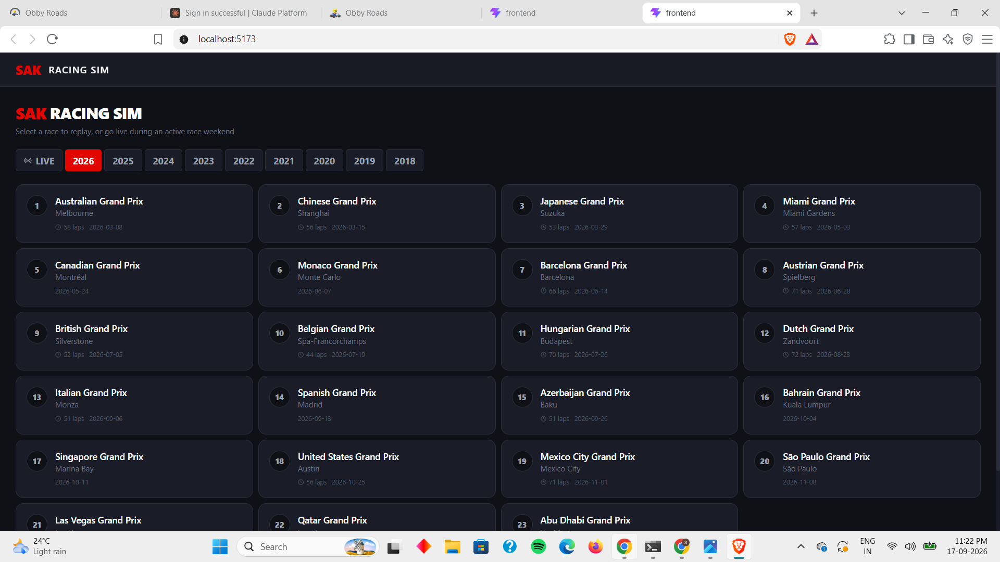

# SAK RACING SIM

A full-stack Formula 1 race and strategy simulator. Pick any race from 2018 to 2026 and watch it replay lap by lap
while Monte Carlo simulations update every driver's win and podium chances, test pit-stop what-ifs, and dig into
45+ analyses per race: pace, consistency, strategy, tyres and race flow. There is also a zoomable circuit map that
replays every driver's smoothed lap, and a local search box that answers questions about a season.



> Everything runs on your own machine. There are no accounts, no API keys, no paid services and no language model
> involved. Race data comes from the free [FastF1](https://github.com/theOehrly/Fast-F1) library and is cached on
> your disk after the first download.

For a deep explanation of how it all works, read **[TECHNICAL.md](TECHNICAL.md)**.

---

## Contents

1. [What you can do with it](#what-you-can-do-with-it)
2. [What you need](#what-you-need)
3. [Quick start (5 minutes)](#quick-start-5-minutes)
4. [Step-by-step setup](#step-by-step-setup)
5. [Warming the cache (recommended)](#warming-the-cache-recommended)
6. [Using the app](#using-the-app)
7. [Configuration](#configuration)
8. [Running the tests](#running-the-tests)
9. [Building for production](#building-for-production)
10. [Troubleshooting](#troubleshooting)
11. [FAQ](#faq)
12. [Project layout](#project-layout)
13. [API quick reference](#api-quick-reference)
14. [Data, credits and licence](#data-credits-and-licence)

---

## What you can do with it

| Area | What it does |
|---|---|
| **Historical replay** | 174 races from 2018 to 2026 streamed lap by lap at 2x, 5x or 10x speed, with a live leaderboard (gaps, tyres, pit stops, fastest lap). |
| **Win probability** | A 500-run Monte Carlo simulation re-runs on every lap and shows each driver's win and podium chance. |
| **Strategy lab** | Counterfactual "what if car X pits on lap N for tyre Y?", an undercut calculator, and optimal pit windows. |
| **Analytics tab** | Race-trace, lap-time, pace-distribution, gap heatmap, pit-stop, tyre-age, places-gained and consistency charts, plus a driver table. |
| **Insights tab** | 45+ named analyses per race in five groups, a strategy timeline, pace ranking, tyre wear curves, a lead timeline, a team scorecard and season roll-ups. |
| **Ask the season** | Type a question such as "which race had the most safety cars?" and get the best-matching computed facts, per season or across all seasons. |
| **Trajectory map** | Every driver on one lap, smoothed to a continuous 60 Hz path, drawn on the circuit with a coloured arrow and 3-letter code each. Zoom, pan, follow a driver, and see estimated off-track excursions. |
| **Telemetry** | Speed, throttle, brake and gear traces for a driver on a lap, plus sector-time heatmaps. |
| **Qualifying and championship** | Qualifying results, and driver and constructor standings computed from the races themselves. |

Race weekends that F1 has not run yet are listed but cannot be replayed. **2022 is deliberately not included**: F1's
timing archive refuses every 2022 file (see [FAQ](#faq)).

---

## What you need

| Requirement | Version | Notes |
|---|---|---|
| **Python** | 3.11 (3.10 to 3.12 should work) | The pinned NumPy 1.26 has no wheels for 3.13+. |
| **Node.js** | 20.19+ or 22.12+ | Needed by Vite 8. `node --version` to check. |
| **npm** | comes with Node | |
| **Git** | any | Only to clone the repository. |
| **Internet** | first run only | To download race data. After that the app works offline for cached races. |
| **Disk space** | about 3 GB free | The full cache is about 2 GB. You can cache only some races. |
| **A modern browser** | Chrome, Edge, Firefox, Safari | The trajectory map uses `<canvas>` and `ResizeObserver`. |

You do **not** need Docker, a database, a GPU, a Redis server or any cloud account.

---

## Quick start (5 minutes)

Open **two terminals**.

**Terminal 1: backend**

```bash
git clone https://github.com/SAKET555/F1-simulator.git
cd F1-simulator/backend            # (the repository folder may be named differently)

python -m venv .venv
# macOS / Linux:
source .venv/bin/activate
# Windows PowerShell:
#   .venv\Scripts\Activate.ps1
# Windows cmd:
#   .venv\Scripts\activate.bat

pip install -r requirements.txt
python -m uvicorn main:app --host 127.0.0.1 --port 8000
```

**Terminal 2: frontend**

```bash
cd F1-simulator/frontend
npm install
npm run dev
```

Open **http://localhost:5173** in your browser, click a season, then click a race.

The first time you open a race that is not cached yet, the backend downloads it. That takes roughly 10 to 60
seconds and the page shows a loading state. Afterwards it is instant.

---

## Step-by-step setup

### 1. Get the code

```bash
git clone https://github.com/SAKET555/F1-simulator.git
cd F1-simulator
```

The repository has two halves:

```
backend/     Python API, simulation and analytics
frontend/    React user interface
cache/       created automatically: downloaded and processed race data (git-ignored)
```

### 2. Create a Python virtual environment

A virtual environment keeps this project's packages separate from everything else on your computer. Strongly
recommended: the pinned versions (`numpy==1.26.4`, `fastapi==0.111.0`, ...) can clash with other tools you have.

```bash
cd backend
python -m venv .venv
```

Activate it:

| Shell | Command |
|---|---|
| macOS / Linux (bash, zsh) | `source .venv/bin/activate` |
| Windows PowerShell | `.venv\Scripts\Activate.ps1` |
| Windows cmd | `.venv\Scripts\activate.bat` |
| Git Bash on Windows | `source .venv/Scripts/activate` |

Your prompt should now start with `(.venv)`.

> **Windows PowerShell says scripts are disabled?** Run `Set-ExecutionPolicy -Scope CurrentUser RemoteSigned` once,
> then activate again.

### 3. Install the backend dependencies

```bash
pip install -r requirements.txt
```

This installs FastAPI, Uvicorn, FastF1 (which brings in pandas, SciPy and requests-cache), NumPy, Matplotlib,
Pydantic, httpx and pytest. It takes a minute or two.

> **"Permission denied" or "Consider using the `--user` option"?** You are not inside a virtual environment.
> Activate it (step 2) or add `--user`.

Check the install:

```bash
python -c "import fastapi, fastf1, numpy, pandas, scipy, matplotlib; print('ok')"
```

### 4. Start the backend

Still inside `backend/`:

```bash
python -m uvicorn main:app --host 127.0.0.1 --port 8000
```

Add `--reload` while developing so it restarts when you edit Python files.

Check that it is alive:

```bash
curl http://127.0.0.1:8000/api/health
# {"status":"ok","app":"SAK RACING SIM","version":"2.0.0"}
```

The interactive API documentation is at **http://127.0.0.1:8000/docs**.

On startup the backend builds (or reads) the race calendar in the background. The first time ever this needs the
internet and takes a few seconds; afterwards it reads `cache/calendar_cache.json` instantly.

### 5. Install and start the frontend

In a **second terminal**:

```bash
cd frontend
npm install
npm run dev
```

Vite prints the address, normally **http://localhost:5173**. Open it.

> **The page loads but no races appear?** The backend is not running, or the frontend is on a different port than
> the backend allows. See [Troubleshooting](#troubleshooting).

---

## Warming the cache (recommended)

Every race is downloaded from F1 the first time you open it, then stored on disk. To download everything in one go
(so the app is instant from then on, even offline):

```bash
cd backend
python scripts/cache_all_races.py
```

* It downloads every **past** race that is not cached yet, one at a time, and builds its insights as it goes.
* Expect roughly **20 to 30 minutes** and about **2 GB** of disk on a decent connection.
* It is **safe to stop and restart**: finished races are skipped.
* You can limit it to some seasons: `python scripts/cache_all_races.py 2023 2024`.
* Races dated today or in the future are skipped automatically.
* It prints a summary at the end, listing any race that failed and why.

If you skip this step nothing breaks; you just pay the download once per race as you visit it.

---

## Using the app

### Choosing a race

The home screen shows a season selector and a search box. Cards marked **cached** open instantly. Click a card to
open the race dashboard. Use **Races** (top right) or click the logo to go back.

### The dashboard tabs

| Tab | What is in it |
|---|---|
| **Overview** | Race header (lap counter, progress bar, weather), the live **leaderboard**, **win probability** bars, a top-3 snapshot and the **counterfactual** ("what if?") panel. |
| **Charts** | Gap-to-leader lines and the current lap-time bars. |
| **Analytics** | Circuit outline, podium, "Race in numbers", the driver breakdown table and eight full-race charts. |
| **Insights** | Highlights, strategy timeline, pace ranking, field pace by lap, tyre wear curves, who-led-when, team scorecard, **Ask the season**, and the 45+ analysis cards grouped by category. |
| **Telemetry** | Speed/throttle/brake/gear for one driver and lap, sector heatmap, and the **trajectory and track limits** map. |
| **Strategy** | Undercut calculator, counterfactual panel and the tyre-strategy bars. |
| **Qualifying** | Qualifying results and the championship standings after this race. |

### Controls while a race replays

| Control | What it does |
|---|---|
| **Space** | Pause / resume |
| **2**, **5**, **0** (or **1**) | Set speed to 2x, 5x or 10x |
| Speed buttons (top right) | Same as the keys |
| **Share** | Copies the page address to the clipboard |

Keyboard shortcuts are ignored while you are typing in a text box or a drop-down.

### The trajectory map (Telemetry tab)

1. Type a **lap number** and press **Load lap**.
2. The first load of a race downloads its telemetry (30 to 70 seconds). Loading another lap of the same race is
   quick.
3. Every driver who completed that lap appears as an arrow with a 3-letter code, each in their own colour.
4. **Scroll** to zoom (up to 40x), **drag** to pan. The buttons on the right zoom in and out, fit the whole circuit
   and toggle **follow** on the selected driver.
5. Click a driver in the legend under the map to select them. The info card shows their off-track status.
6. Amber dashed lines mark **estimated** off-track excursions. They are estimates: F1's data has no kerb or
   white-line geometry, so the app measures distance from a reference racing line. Read the note under the map.

Some seasons have no position data at all (all of 2026 at the time of writing); the map then says so.

### Ask the season

In the **Insights** tab, type a question and press **Ask**, or click one of the example chips. It searches
statistics computed from your cached races and returns the best-matching facts with the race each came from. It
does not write answers, so it cannot invent one. The scope selector switches between the current season and all
seasons.

---

## Configuration

All settings have sensible defaults; you normally change nothing.

### Backend settings (`backend/.env`)

Create `backend/.env` if you need to override anything. Values are read by `pydantic-settings`; list values are
JSON.

| Variable | Default | Meaning |
|---|---|---|
| `CACHE_DIR` | `<repo>/cache` | Where downloaded and processed data lives. |
| `CORS_ORIGINS` | `["http://localhost:5173","http://localhost:3000"]` | Browser origins allowed to call the API. |
| `DEBUG` | `true` | Reserved. |

Example, if Vite picked port 5174 because 5173 was busy:

```
CORS_ORIGINS=["http://localhost:5173","http://localhost:5174"]
```

### Frontend API address

The frontend calls the backend at **http://localhost:8000** (`frontend/src/lib/constants.js`, plus one line in
`frontend/src/App.jsx` for shared links). If you run the backend elsewhere, change those addresses.

### Ports

| Service | Default port |
|---|---|
| Backend (Uvicorn) | 8000 |
| Frontend (Vite dev server) | 5173 |

---

## Running the tests

From `backend/` with the virtual environment active:

```bash
python -m pytest -q
```

24 tests, about 5 seconds. Some tests read your local cache and are skipped if it is empty. The Monte Carlo tests
run without any data. `tests/test_ws_client.py` is a manual smoke test for the WebSocket, run separately while
the backend is up:

```bash
python tests/test_ws_client.py
```

Frontend checks:

```bash
cd frontend
npm run lint     # oxlint
npm run build    # production build; fails on import errors
```

---

## Building for production

The backend is a normal ASGI app; the frontend compiles to static files.

```bash
cd frontend
npm run build          # writes frontend/dist
npm run preview        # serve the build locally on port 4173
```

To deploy, serve `frontend/dist` from any static host and run the backend with several workers:

```bash
cd backend
python -m uvicorn main:app --host 0.0.0.0 --port 8000 --workers 2
```

Before deploying, change the hard-coded `localhost:8000` addresses in the frontend to your API address and add
your site's address to `CORS_ORIGINS`. Read the licence and the data notes below before publishing anything: the
race data belongs to Formula One, not to this project.

---

## Troubleshooting

| Symptom | Cause and fix |
|---|---|
| `pip install` says **permission denied** / `--user` | You are outside a virtual environment. Create and activate `.venv` (step 2). |
| `ModuleNotFoundError: fastf1` | The backend was started with a different Python than the one you installed into. Activate `.venv` and use `python -m uvicorn ...`. |
| `numpy` errors on install | Use Python 3.10 to 3.12; NumPy 1.26 has no wheels for 3.13. |
| **Race list is empty / "Failed to load races"** | Backend not running, or wrong port. Check `curl http://127.0.0.1:8000/api/health`. |
| Browser console: **CORS error** | The frontend port is not in `CORS_ORIGINS` (see Configuration). |
| **Port 8000 already in use** | Something else uses it. Stop it, or start Uvicorn with `--port 8001` and change the frontend address. |
| **Port 5173 already in use** | Vite moves to 5174; add that to `CORS_ORIGINS`. |
| First open of a race is slow | It is downloading. Run `scripts/cache_all_races.py` once. |
| Log line **"Failed to load result data from Ergast"** | Harmless. The old Ergast service is retired; the app derives results from lap timing instead. |
| **`KeyError: 'DriverNumber'`** for a 2022 race | F1's servers refuse 2022 (HTTP 403). 2022 is excluded from the app. |
| Trajectory map: **"Failed to load telemetry data"** | That session has no position data (all of 2026 so far). Try an older race. |
| Trajectory map shows amber lines near lap start or under a safety car | Estimated excursions next to missing data are labelled "uncertain". See the note under the map. |
| A **very recent race** will not load | F1 publishes data some time after a session; try again later. |
| The whole page is unstyled | Run `npm install` again and restart `npm run dev`. |
| Fonts look plain | Fonts load from Google Fonts; offline they fall back to system fonts. Everything still works. |
| `git` warns "LF will be replaced by CRLF" on Windows | Harmless line-ending notice. |

Still stuck? Look at the backend terminal: every error is logged there with the race and driver involved.

---

## FAQ

**Is the data real?** Yes. It is the same timing data the F1 broadcast uses, fetched through FastF1. Nothing is made
up. Some figures in the app are *estimates computed from that data* (overtakes, undercuts, pit-stop time loss, tyre
wear, off-track excursions) and the app labels them as estimates.

**Are the win probabilities a forecast?** No. They come from a deliberately simple model that treats every driver as
equally fast and varies only tyres, gaps and pit timing. Treat them as a way to explore "what does tyre age and
track position do", not as a prediction. TECHNICAL.md explains the model and its limits in detail.

**Why is 2022 missing?** F1's live-timing archive answers every 2022 request with `403 Access Denied` (checked in
September 2026), while 2021 and 2023 work. Nothing in this project can fix a refusal on their server, and we do not
try to work around it, so the season is left out. If it ever opens up, remove `2022` from `UNAVAILABLE_YEARS` in
`backend/app/engine/calendar.py`.

**Why does the trajectory map not work for 2026?** FastF1 reports "Failed to load telemetry data" for 2026
sessions, so no car positions exist to draw. Lap timing, replay and analytics work for cached 2026 races.

**Can I use it during a live race weekend?** Live timing was removed. F1's data sources restrict access while a
session is running, and the free tier of the OpenF1 service does not include live data. Everything here is
historical replay.

**Is this allowed?** For personal, non-commercial use on your own machine it sits at the low-risk end, but the data
belongs to Formula One and its terms restrict scraping and redistribution. Do not publish the cached data or sell
access to it. This is not legal advice.

**Does it need a GPU or a lot of RAM?** No. A laptop is fine. The Monte Carlo runs are vectorised NumPy and take
milliseconds. Analytics for a race take about a second.

**How do I reset everything?** Stop the servers and delete the `cache/` folder. It is rebuilt on demand.

---

## Project layout

```
.
├── README.md                     this file
├── TECHNICAL.md                  how it all works (long)
├── LICENSE / NOTICE              Apache-2.0
├── cache/                        generated data (git-ignored)
│   ├── calendar_cache.json       the race calendar
│   ├── fastf1_http_cache.sqlite  FastF1's own HTTP cache
│   └── processed/                our cleaned lap tables, per-query results, charts, insights
├── backend/
│   ├── main.py                   entry point (creates the FastAPI app)
│   ├── requirements.txt
│   ├── scripts/cache_all_races.py
│   ├── app/
│   │   ├── core/                 app factory and settings
│   │   ├── routers/              HTTP and WebSocket endpoints
│   │   ├── engine/               all the real logic (data, replay, simulation, analytics, insights, search, trajectory)
│   │   └── schemas/              Pydantic models shared by the API
│   └── tests/
└── frontend/
    ├── index.html, vite.config.js, tailwind.config.js
    └── src/
        ├── App.jsx               the shell: header, tabs, layout
        ├── index.css             design tokens and shared styles
        ├── components/           one file per panel or chart
        ├── hooks/                WebSocket, keyboard and share-link hooks
        └── lib/constants.js      API addresses, team and tyre colours
```

---

## API quick reference

Base address `http://localhost:8000`. Full details and examples are in TECHNICAL.md; the live, interactive version
is at `/docs`.

| Method | Path | Purpose |
|---|---|---|
| GET | `/api/health` | Liveness check |
| GET | `/api/races` | The race calendar with a `cached` flag |
| GET | `/api/races/{id}` | One race's metadata |
| WS | `/ws/race/{id}?speed=2` | Lap-by-lap replay stream with predictions |
| GET | `/api/races/{id}/gaps` | Gap-to-leader history |
| GET | `/api/races/{id}/stints` | Tyre stints per driver |
| GET | `/api/races/{id}/weather` | Weather per lap |
| GET | `/api/races/{id}/qualifying` | Qualifying results |
| GET | `/api/races/{id}/sectors?driver=` | Sector times |
| GET | `/api/races/{id}/telemetry?driver=&lap=` | Raw telemetry for one lap |
| GET | `/api/races/{id}/points` | Points this race and standings after it |
| GET | `/api/championship/{year}/drivers` | Season driver standings |
| GET | `/api/races/{id}/analytics/summary` | Race statistics |
| GET | `/api/races/{id}/analytics/charts/{chart}.png` | Rendered chart |
| GET | `/api/races/{id}/circuit.png` | Circuit outline image |
| GET | `/api/races/{id}/insights` | The per-race analyses |
| GET | `/api/seasons/{year}/insights` | Season roll-ups |
| GET | `/api/rag/search?q=&year=` | Search the computed facts |
| GET | `/api/races/{id}/trajectory?driver=&lap=` | One driver's smoothed lap |
| GET | `/api/races/{id}/trajectories?lap=` | Every driver's smoothed lap |
| POST | `/api/simulate/counterfactual` | Pit-stop what-if |
| POST | `/api/simulate/undercut` | Undercut analysis |
| POST | `/api/simulate/optimal-stop` | Best pit windows |

---

## Data, credits and licence

* Race data: [FastF1](https://github.com/theOehrly/Fast-F1) (MIT licence), which reads Formula One's live-timing
  archive. Formula 1, F1 and related marks belong to Formula One Licensing BV. This project is an independent fan
  project and is not affiliated with or endorsed by Formula 1, the FIA or any team.
* Built with FastAPI, NumPy, pandas, SciPy, Matplotlib, React, Vite, Tailwind CSS, Recharts and Lucide icons.
* Licensed under the **Apache License 2.0**; see [LICENSE](LICENSE) and [NOTICE](NOTICE).
